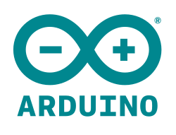
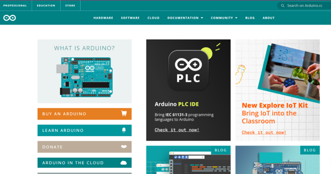

# ArduinoParaInexpertxs
Arduino para Inexpertxs considera los conocimientos básicos para empezar a trabajar con tu tarjeta eléctronica.

Creado por:
Compañeros, compañeras y compañeres del curso de Arduino a cargo de le Profesore Aaron Montoya [montoyamoraga](https://github.com/montoyamoraga)

Hola! Mi nombre es Victoria (Vick) y soy estudiante de Diseño. He creado está guía en parte para agradecerle a mi Maestre, Aaron Montoya y, por otro lado, para apoyar a aquellas personas que deseen empezar a utilizar esta maravillosa herramienta, con la cual se pueden crear infinidad de proyectos. Espero te sirva y disfrutes este viaje. Mucho éxito!

¿Qué es Arduino?

